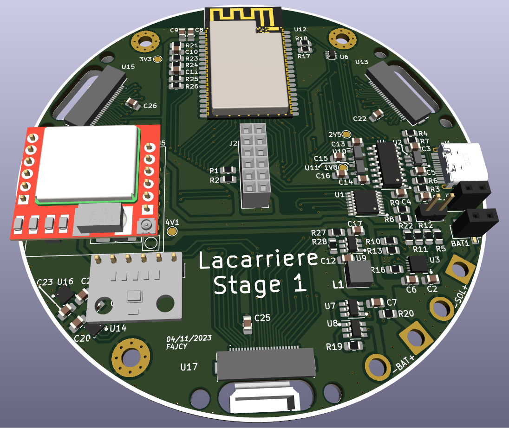

# Lacarriere Station 

## Specs
### Stage 1
- Powered by a battery recharged by a solar panel
- Three VGA cameras to take 360° photos
- Measures temperature/humidity/pressure with Bosch sensors
- Sends data via 2G+ network

### Stage 2
...

### Stage 3
...

## Sofwares
- KiCAD 7
- FreeCAD 0.20
